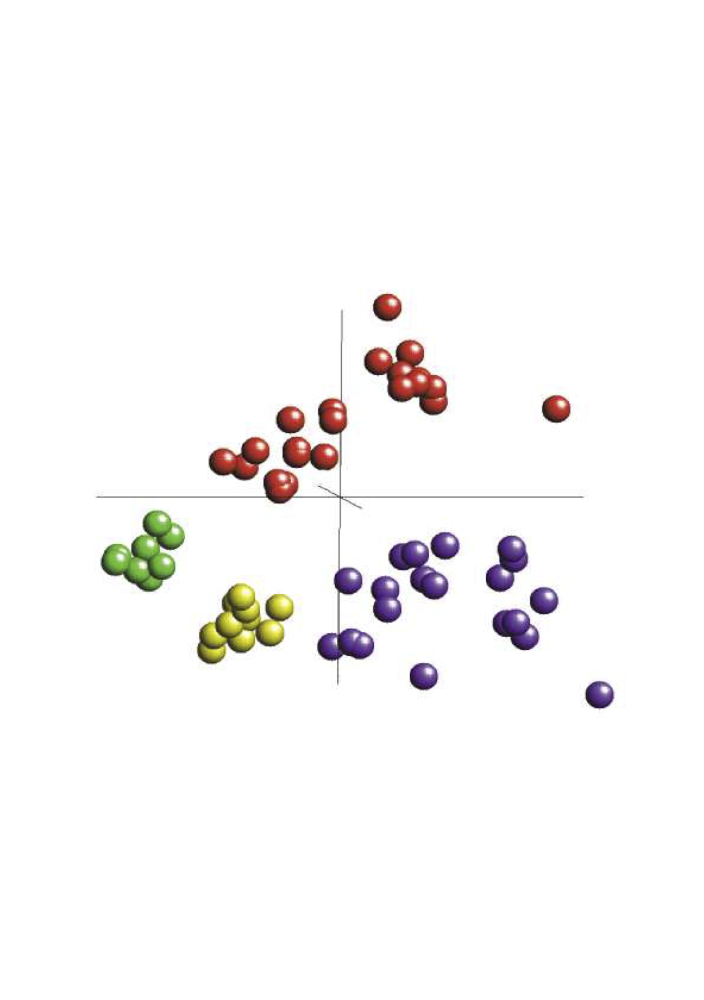

```{r style, echo = FALSE, results = 'asis'}
    BiocStyle::markdown(css.files = c('custom.css'))
```


#Introduction


```{r}
library(ade4)
library(made4)
library(scatterplot3d)
```

The package *made4* facilitates multivariate analysis of microarray gene expression data.  The package provides a set of 
functions that utilise and extend multivariate statistical and graphical functions available in ade4,  [@thioulouse_ade-4_1997] .  
*made4* accepts gene expression data is a variety of input formats, including Bioconductor formats, 
- SummarizedExperiment
- ExpressionSet
- data.frame
- matrix
and older microarray formats; ExpressionSet, marrayRaw

#Installation

*made4* requires the R package *ade4*.  It should be installed automatically when you install *made4*. To install *made4* from bioconductor

```{r eval=FALSE}
if (!requireNamespace("BiocManager", quietly=TRUE))
    install.packages("BiocManager")
BiocManager::install("made4")
```

#Further help

The package *made4* is described in more detail in the RNews newletter, December 2006.

Culhane AC and Thioulouse J. (2006) A multivariate approach to integrating datasets using made4 and ade4.**R News**, *6(5)* 54-58.
[pdf](http://cran.r-project.org/doc/Rnews/Rnews_2006-5.pdf)


Extensive tutorials, examples and documentation on multivariate statistical methods are available from [the ade4 website] 
(http://pbil.univ-lyon1.fr/ADE-4) and *ade4* user support  
is available through the ADE4 mailing list.

This tutorial assumes a basic knowledge of R, but we have found that Emmanuel Paradis's *R for Beginners* is a 
very good guide to those unfamiliar with R. This is [available at] (http://cran.r-project.org/doc/contrib/Paradis-rdebuts_en.pdf).

This documents assumes that data is normalised and preprocessed.


#Citing
We are delighted if you use this package. Please do email us if you find a bug or have a suggestion.  We would be very grateful if you could cite:

Culhane AC, Thioulouse J, Perriere G, Higgins DG.(2005) MADE4: an R package for multivariate analysis of gene expression data. **Bioinformatics** *21(11):* 2789-90. 


#Quickstart

We will very briefly demonstrate some of the functions in *made4*. To do this 
we will use a small dataset that is available in *made4*. This dataset **Khan** contains gene expression profiles of four types of small round blue cell tumours of childhood (SRBCT) published by Khan et al. (2001). This is a subset of the published dataset. It contains gene expression levels for 306 genes for 64 patient samples.  Load the necessary R packages and dataset. 

```{r}
 library(made4)
 library(ade4)
 data(khan)
```

This experiment studied gene expression in patient with four types of SRBCT. These were neuroblastoma (NB), rhabdomyosarcoma (RMS), Burkitt lymphoma, a  subset of non-Hodgkin lymphoma (BL), and the Ewing family of tumours (EWS). Gene expression profiles from both tumour biopsy and cell line  samples were obtained and are contained in this dataset. In this study data were divided into a training set of 64 samples, and a blind test dataset.  These 2 dataset are called khan\$train and khan\$test.  Have a look at the data.  For this example we will just example the training dataset. 

```{r}
names(khan)
k.data<-khan$train
k.class<-khan$train.classes
```

##Overview


The *made4* function **overview()** provides a quick way to get an overview or feel for data.  **overview()** will draw a boxplot, histogram and dendrogram of a hierarchical analysis.  Hierarchical clustering is produced using average  linkage clustering with a Pearson correlation measure of similarity  [@eisen_cluster_1998]
 This gives a quick first glance at the data. 

```{r overview.extra, eval=FALSE}
overview(k.data)
```

Often its useful to label the samples using a class vector or covariate of interest, in this case, the tumour type (EWS, BL, NB or RMS).


```{r overviewKhan,fig.width=7,fig.height=6, fig.cap="\\label{fig:fig1}Overview of Khan data."}

overview(k.data, labels=k.class)
```
Figure 1: A) dendrogram showing results of average linkage clustering, B) boxplot and C) histrogram.


Often one will known classes in the data (eg Normal v Treatment, or different tumor types). We can insert a class colourbar under the dendrogram, and colour the boxplot.


```{r overviewKhan2,fig.width=7,fig.height=6, fig.cap="\\label{fig:fig2}Overview of Khan data."}

overview(k.data, classvec=k.class, labels=k.class)
```
A) dendrogram showing results of average linkage clustering, B) boxplot and C) histrogram. In this case we have added a vector of class (classvec) to color the overview by class membership.


#Prinipcal Component, Correspondence Analysis

The function **ord** simplifies the running of ordination methods such as principal component, correspondence or non-symmetric correspondence analysis. It provides a wrapper which can call each of these methods in *ade4*. To run a correspondence analysis [@fellenberg_correspondence_2001] on this dataset. 

```{r}
k.coa<- ord(k.data, type="coa")
```

Output from **ord** is a list of length 2, containing the ordination results (\$ord) and a factor (\$fac) if input.  The ordination results 
(k.coa\$ord) contain a list of results (of length 12) which includes the eigenvalues (\$eig) and the new column coordinates (\$co) and the row (line) coordinatein \$li. Hence we can visualise the projected coordinations of the genes (\$li, 306 genes) and  array samples (\$co, 64 microarray samples).    

```{r output.coa}
names(k.coa)
summary(k.coa$ord)
```


## Visualising Results

There are many functions in *ade4* and *made4* for visualising results from ordination analysis. The simplest way 
to view the results produced by **ord** is to use **plot**.  **plot(k.ord)** will draw a plot of the eigenvalues, along with plots of the variables (genes) and a plot of the cases (microarray samples).  In this example Microarray samples are colour-coded using the **classvec**  **khan\$train.classes** which is saved as **k.class**.  

```{r see.classes}
k.class
```

```{r plotcoa}
plot(k.coa, classvec=k.class, genecol="grey3")
```
*Figure 2* Correspondence analysis of Khan dataset. A. plot of the eigenvalues, B. projection of microarray samples from patient with tumour types EWS (red), BL(blue), NB (green) or RMS (brown), C. projection of genes (gray filled circles) and D. biplot showing both genes and samples.   Samples and genes with a strong associated are projected in the same direction from the origin.  The greater
the distance from the origin the stronger the association.


Genes and array projections can also be plotted using **plotgenes** and **plotarrays**.  The function **s.groups** required a character vector or factor  that indicates the groupings or classes (classvec)  and allowed groups to be coloured in different colours. For example, to plot microarray samples (cases),

```{r plotgenesCOA,eval=FALSE}
plotgenes(k.coa)  
```

To plot microarray samples, colour by group (tumour type) as specified by khan\$train.classes 

```{r plotarrays}
plotarrays(k.coa, arraylabels=k.class)
```

Alternative you can run these analysis and give a class vector to **ord** and it will automatically colour samples by this class vector

```{r plotarays2}
k.coa2<-ord(k.data, classvec=k.class)
plot(k.coa2)
```

Plot gene projections without labels (clab=0). Typically there are a large number of genes, thus it is not feasible to label all of these.
The function plotgenes is more useful to use if you wish to add labels when there are lots of variables (genes)


The gene projections can be also visualised with **plotgenes**. The number of genes that are labelled 
at the end of the axis can be defined. The default is 10.

```{r plotgenes}
plotgenes(k.coa, n=5, col="red")
```


By default the variables (genes) are labelled with the rownames of the matrix. Typically these are spot IDs or Affymetrix accession numbers which are not very easy to interpret.  But these can be easily labeled by your own labels.  For example its often useful to labels using HUGO gene symbols.  We find the Bioconductor *annotate* or *biomaRt* annotation packages are  useful for this.   

In this example we provide annotation from the Source database in khan\$annotation.  The gene symbol are in the vector khan\$annotation\$Symbol.  (In this case its a factor) 

```{r plotgenescmd}
gene.symbs<- khan$annotation$Symbol 
gene.symbs[1:4]
```


```{r plotgenesSym}
plotgenes(k.coa, n=10, col="red", genelabels=gene.symbs)
```
*Figure 3* Projection of genes (filled circles) in Correspondence analysis of Khan dataset.  The genes at the ends of each of the axes are labelled with HUGO gene symbols. 


To get a list of variables at the end of an axes, use **topgenes**. For example, to get a list of the 5 genes at the negative and postive end of axes 1. 

```{r topgenes, eval=FALSE}
topgenes(k.coa, axis = 1, n=5)   
```

To only the a list of the genes (default 10 genes) at the negative end of the first axes

```{r topgenes2}
topgenes(k.coa, labels=gene.symbs, end="neg") 
```

Two character vectors can be compared using (the very poorly named function) **comparelists**


To visualise the arrays (or genes) in 3D either use **do3d** or **html3d**. **do3d** is a wrapper for **scatterplot3d**, 
but is modified so that groups can be coloured.   

```{r do3d}
do3d(k.coa$ord$co, classvec=k.class, cex.symbols=3)
```

**html3d** produces a "pdb" output which can be visualised using rasmol or chime, a free interface for colour, rotating, zooming 3D graphs. The output from Output from **html3D** can be rotated and visualised on web browsers that can support chime (or a pdb viewer)

```{r eval=FALSE}
html3D(k.coa$ord$co, k.class, writehtml=TRUE)
```

```{r html3D, echo=FALSE, fig.cap="Output from html3D"}

```


## explor
It is also worth exploring the package *explor* which provides a nice R Shiny interface for browsing results from *made4* and *ade4*. 
It is available from CRAN or from [juba.github.io](https://juba.github.io/explor/)


##Classification and Class Prediction using Between Group Analysis

Between Group Analysis (BGA) is a supervised PCA method [@doledec_rythmes_1987] for classification/prediction. The basis of BGA is to ordinate the groups rather than the individual samples. 

In tests on two microarray gene expression datasets, BGA performed comparably to supervised classification methods, including support vector machines and artifical neural networks [@culhane_between-group_2002].   To train a dataset, use **bga**, the projection of test data can be assessed using **suppl**. One leave out cross validation can be performed using **bga.jackknife**. See the BGA vignette for more details on this method.

```{r bga}
k.bga<-bga(k.data, type="coa", classvec=k.class)
```

```{r BGAplot}
plot(k.bga, genelabels=gene.symbs) # Use the gene symbols earlier
```
*Figure 5* Between group analysis of Khan dataset. A. Between.graph
	of the microarray samples, showing their separation on the discriminating BGA axes, B. Scatterplot of the first 2 axes of microarray samples, coloured by their class, C. graph of positions of genes on the same axis.  Genes at the ends of the axis are most discriminating for that group


Sometimes its useful to visualise 1 axes of an analysis. To do this use **graph1D** or **between.graph**.  The latter function is specifically for visualising results from a bga as it shows the separation of classes achieved.

```{r between.graph, fig.width=6, fig.height=4}
between.graph(k.bga, ax=1)  # Show the separation on the first axes(ax)
```


## Meta-analysis of microarray gene expression 
Coinertia analysis **cia** [@doledec_s_co-inertia_1994] has been successfully applied to the cross-platform  comparison of microarray gene expression datasets [@culhane_cross-platform_2003, @meng_multivariate_2014, @meng_integrative_2016, @meng_dimension_2016], . CIA is a multivariate method  that identifies trends or co-structure in the variance of multiple datasets which contain the same samples. That is either the rows  or the columns of a matrix must be "matchable".  CIA can be applied to datasets where 
the number of variables (genes) far exceeds the number of samples (arrays) such is the case with microarray analyses.
 **cia** calls **coinertia** in the *ade4* package. See the CIA vignette for more details on this method. 

There are extended version of CIA in the Bioconducor packages **mogsa** and **omicade4** [@meng_multivariate_2014, @meng_integrative_2016, @meng_dimension_2016]

```{r CIA}
# Example data are "G1_Ross_1375.txt" and "G5_Affy_1517.txt"
data(NCI60)
coin <- cia(NCI60$Ross, NCI60$Affy)
names(coin)
coin$coinertia$RV
```

The RV coefficient \$RV which is `r signif(coin$coinertia$RV,3)` in this instance, is a measure of global similarity between the datasets.  
The greater (scale 0-1) the better.


```{ CIAplot}
plot(coin, classvec=NCI60$classes[,2], clab=0, cpoint=3)
```
*Figure 6* Coinertia analysis of NCI 60 cell line Spotted and Affymetrix gene expression dataset. The same 60 cell lines were analysed by two different labs on a spotted cDNA array (Ross) and an affymetrix array (Affy).  The Ross dataset contains 1375 genes, and the affy dataset contains 1517. There is little overlap betwen the genes represented on these platforms.  CIA allows visualisation of genes with similar expression patterns across platforms. A) shows 
a plot of the 60 microarray samples projected onto the one space.  The 60 circles represent dataset 1 (Ross) and the 60 arrows represent dataset 2 (affy).  Each circle and arrow are joined by a line, the length of which is proportional to the divergence between that samples in the two datasets.  The samples are coloured by cell type. B) The gene projections from datasets 1 (Ross), C) the gene projections from 
dataset 2 (Affy).  Genes and samples projected in the same direction from the origin show genes that are expressed in those samples. See vingette for more help on interpreting these plots.


#Functions in made4

## Data Input
\begin{table}[h!]
\begin{tabular}{p{3.5cm} p{12cm}}
array2ade4 & Converts matrix, data.frame, ExpressionSet, marrayRaw microarray 
gene expression data input data into a data frame suitable for analysis in 
ADE4. The  rows and columns are expected to contain the variables (genes) 
and cases (array samples)  \\
overview & Draw boxplot, histogram and hierarchical tree of gene 
expression data. This is useful only for a \textit{brief first glance} at data.\\
\end{tabular}
\end{table}

## Example datasets provides with made4
\begin{table}[h!]
\begin{tabular}{p{3.5cm} p{12cm}}
khan & Microarray gene expression dataset from Khan et al., 2001 \\
NCI60 & Microarray gene expression profiles of the NCI 60 cell lines \\
\end{tabular}
\end{table}


## Classification and class prediction using Between Group Analysis
\begin{table}[h!]
\begin{tabular}{p{3.5cm} p{12cm}}
bga & Between group analysis \\
bga.jackknife & Jackknife between group analysis \\
randomiser & Randomly reassign training and test samples \\
bga.suppl & Between group analysis with supplementary data projection \\
suppl & Projection of supplementary data onto axes from a between group analysis \\
plot.bga & Plot results of between group analysis \\
between.graph & Plot 1D graph of results from between group analysis \\
\end{tabular}
\end{table}

## Meta analysis of two or more datasets using Coinertia Analysis 
\begin{table}[h!]
\begin{tabular}{p{3.5cm} p{12cm}}
cia & Coinertia analysis: Explore the covariance between two datasets \\
plot.cia & Plot results of coinertia analysis \\
\end{tabular}
\end{table}

## Graphical Visualisation of results: 1D Visualisation
\begin{table}[h!]
\begin{tabular}{p{3.5cm} p{12cm}}
graph1D & Plot 1D graph of axis from multivariate analysis \\
between.graph & Plot 1D graph of results from between group analysis \\
commonMap & Highlight common points between two 1D plots \\
heatplot & Draws heatmap with dendrograms (of eigenvalues) \\
\end{tabular}
\end{table}


## Graphical Visualisation of results: 2D Visualisation
\begin{table}[h!]
\begin{tabular}{p{3.5cm} p{12cm}}
plotgenes & Graph xy plot of variable (gene) projections from PCA or COA. Only label variables at ends of axes \\
plotarrays & Graph xy plot of case (samples) projections from PCA or COA,and colour by group  \\
plot.bga & Plot results of between group analysis using plotgenes, s.groups and s.var \\
plot.cia & Plot results of coinertia analysis showing s.match.col, and plotgenes \\

s.var &	Use plotarrays instead. Graph xy plot of variables (genes or arrays).  Derived from ADE4 graphics module s.label.  \\
s.groups  & Use plotarrays instead. Graph xy plot of groups of variables (genes or arrays) and colour by group. Derived from ADE4 graphics module s.class \\
s.match.col &	Use plotarrays instead. Graph xy plot of 2 sets of variables (normally genes) from CIA.  Derived from ADE4 graphics module s.match\\
\end{tabular}
\end{table}


## Graphical Visualisation of results: 3D Visualisation
\begin{table}[h!]
\begin{tabular}{p{3.5cm} p{12cm}}
do3d & Generate a 3D xyz graph using scatterplot3d \\
rotate3d & Generate multiple 3D graphs using do3d in which each graph is rotated \\
html3D & Produce web page with a 3D graph that can be viewed using Chime web browser plug-in, and/or a pdb file that can be viewed using Rasmol \\
\end{tabular}
\end{table}

## Interpretation of results
\begin{table}[h!]
\begin{tabular}{p{3.5cm} p{12cm}}
topgenes & Returns a list of variables at the ends (positive, negative or both) of an axis \\
sumstats & Summary statistics on xy co-ordinates, returns the slopes and distance from origin of each co-ordinate \\
comparelists & Return the intersect, difference and union between 2 vectors \\
print.comparelists & Prints the results of comparelists \\
\end{tabular}
\end{table}


# References

